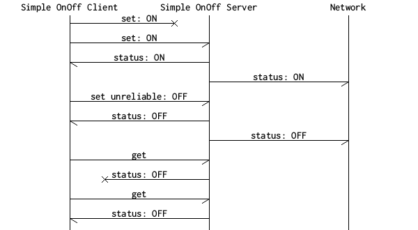

# Simple On/Off Model

This implementation of a simple On/Off model can be used to switch
things on or off by manipulating a single on/off state. The intention of this
model is to have a simple example model that can be used as a baseline for
constructing your own model.

Note that the simple On/Off model should not be confused with the
generic On/Off model as specified in the Mesh Model Specification. The generic
On/Off model provides additional features such as control over when
and for how long the transition between the on/off state should be
performed.

For more information about creating models, see
[Creating custom models](@ref md_doc_getting_started_how_to_models).

**Note:** When the server has a publish address set (as in the light control example), the server
will publish its state to its publish address every time its state changes.

## Messages and behavior

See [the message documentation](@ref SIMPLE_ON_OFF_COMMON) for details about the message format.

The behavior of the simple On/Off server is very simple and illustrated by the following message chart.

