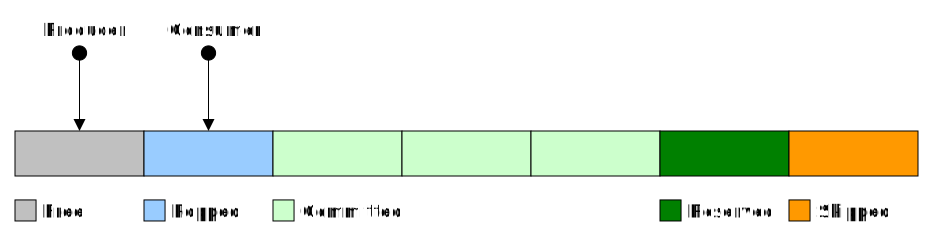

# Packet Manager

The packet manager provides 5 main interface funtions, only 4 of which are for allocating and deallocating, the other function is for initializing a packet manager instance, there are also some helper functions.

The packet manager is based on three critical assumptions:

- One consumer and multiple producers.
- The packets are consumed in the same order they are produced
- The consumer frees a popped packet before popping the next.

There are 5 states a packet may be in:

* `FREE` : Available to the producer to acquire and use, via the reserve call.
* `RESERVED`: Acquired by and under the use of the producer.
* `COMMITED`: Available to the consumer to acquire and read the contents, via the pop call.
* `POPPED`: Acquired by and under the use of the consumer, consumer has to make a free call on this packet before it can acquire another packet.
* `SKIPPED`: A packet that was dropped by the producer (not commited), it has no meaningful information but would have to be freed by a pop call made by the consumer. There are two scenarios that can cause a packet to be in this state:
. 1

